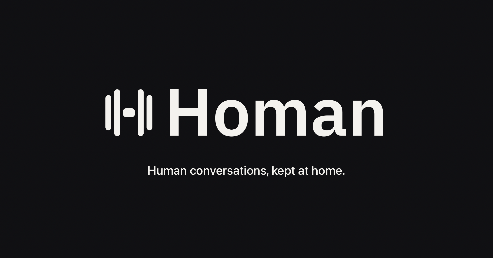

<p align="center">
  
</p>

<h1 align="center">Homan</h1>

<p align="center">
  <strong>A local-first speech workspace for the Mac.</strong><br>
  Dictation and meeting transcription that run on your device — no cloud, no account, no surprises.
</p>

<p align="center">
  <a href="LICENSE"></a>
  
  
  
</p>

---

## What is Homan?

Homan is a lightweight, native macOS app that combines **dictation** and **meeting transcription** in one tool. Speech-to-text runs entirely on-device on Apple Silicon via CoreML and the Neural Engine — your audio stays on your Mac unless you explicitly configure a remote provider. There is no cloud transcription bill and no account to create.

## Why Homan exists

Homan is a fork done on purpose. It keeps the best of local-first speech and reworks it around three commitments that belong together:

1. **A clean architecture, on purpose.** Capture, transcription, and summarization are distinct, deliberate stages with a stable interface. Recording, recovery, retention, and review are one coherent workflow — the data model is not a byproduct of features bolted on later.
2. **Models you actually control.** Models are first-class: choose live and full-quality engines per meeting, override parameters, summarize on-device (Gemma 4 — no API key, no cloud), or bring your own provider. Nothing is silently swapped; nothing you didn't enable leaves your Mac.
3. **Built for operational control.** Predictable behavior for daily, professional use: source-preserving audio, explicit device handling, auditable privacy boundaries, clear settings. The kind of tool a team can standardize on without surprises.

## How it works

```
capture ──▶ transcription ──▶ diarization ──▶ meeting notes ──▶ export
   │              │                │                │
 mic + system   VAD chunks    speaker labels    template +      PDF / Markdown
 audio (stereo) at natural     (You / Others)   on-device or
                 boundaries                     cloud LLM
```

Dictation is a straight line: hold the hotkey → speak → release → text is pasted at your cursor in about **0.13 seconds** (Parakeet TDT on the Neural Engine).

## Features

### Capture
- **Dictation** — hold-to-talk or double-tap hands-free, ~0.13 s latency, clipboard-preserving paste.
- **Meetings** — records your microphone (You) and system audio (Others) as independent stereo sources, with echo cancellation.
- **Meeting detection** — camera + mic + recognized meeting app triggers automatic recording; suppressible per event.
- **Join & Record** — meeting URLs are extracted from calendar events (Zoom, Meet, Teams, Webex, Chime, FaceTime) and offered with a split "Join & Record" control.

### Transcription
- **11 on-device models** — Parakeet v3/v2, Whisper Tiny/Small/Medium/Large Turbo, Cohere Transcribe, Nemotron 3.5 Multilingual, SenseVoice Small, Qwen3 ASR, Indic ASR.
- **Live transcripts** — committed VAD-chunked captions as the meeting happens; optional low-latency English preview.
- **Speaker diarization** — distinguishes You from remote speakers during post-processing.

### Meeting notes
- **On-device Gemma 4 summaries** — the newest path: a Gemma 4 model on your Mac turns the transcript into structured notes. No API key, no cloud, nothing leaves the device.
- **Your choice of providers** — OpenAI, OpenRouter, ChatGPT (OAuth), Ollama, LM Studio, or a custom LLM, with per-meeting overrides and full prompt templates.
- **Meeting templates** — built-in and custom profiles for structured notes.
- **Export** — notes or transcript as paginated PDF (US Letter) or Markdown.

### Control & recovery
- **Stable recording lifecycle** — pause/resume, retention policies, protection, and crash-safe recovery.
- **Calendar integration** — upcoming meetings, pre-meeting countdowns, event-driven notifications.
- **Screen context (opt-in)** — the app name and text near the cursor inform dictation and meeting summaries.

## Privacy and network boundary

Audio and transcripts stay local by default. Network access is used only for providers and features you explicitly enable: a cloud summarization provider you configure, calendar integration you authorize, or an update check. On-device transcription (the default) never sends audio anywhere.

## Install

Download the latest release from [Homan Releases](https://github.com/zebrig/homan/releases). Signed and notarized builds are produced from a clean worktree at an approved commit.

> Development note: until the first signed release is published, run the app from a local build (below).

## Build and test from source

Requires macOS 14.2+, Xcode, and Apple Silicon.

```bash
# Development build (isolated identity, separate data dir)
./scripts/dev-test.sh

# Production build (signed if a Developer ID is configured)
./scripts/build_native_app.sh

# Tests
swift test --package-path native/MuesliNative
```

Models are downloaded on demand from the Models tab — no model is required to build.

## homan-cli

The app ships a small, agent-friendly CLI. It reads the same database and support directory as the app.

```bash
/Applications/Homan.app/Contents/MacOS/homan-cli spec
homan-cli info
homan-cli transcribe meeting.mp3 --format markdown
homan-cli transcribe call.m4a --summarize --save-meeting --title "Customer Interview"
homan-cli download-model --id gemma-4-e4b --url <...> --dest <path> --expected-size 5126306944
homan-cli meetings list --limit 10
homan-cli meetings get 125
homan-cli dictations list --limit 10
```

`homan-cli spec` prints the full command tree and schema.

## Architecture

```
native/MuesliNative/Sources/
├── MuesliNativeApp/     # macOS app (SwiftUI/AppKit) — capture, transcription, notes, settings
├── MuesliCore/          # Shared library — SQLite store, paths, models
└── MuesliCLI/           # homan-cli — agent-friendly JSON over stdout
```

> Internal module names and on-disk paths retain their `Muesli*` / `muesli` spelling for
> compatibility with the upstream project (Homan is a fork). User-visible identity — the app, the
> CLI, and the support directory — is fully Homan.

## Data storage and permissions

- **Config:** `~/Library/Application Support/Homan/config.json`
- **Database:** `~/Library/Application Support/Homan/muesli.db`
- **Models:** `~/.cache/muesli/models/` (shared across app identities)
- **Microphone** — dictation and meeting mic capture
- **Accessibility** — paste at cursor and opt-in screen context
- **Input Monitoring** — global hotkeys
- **Screen Recording** — system audio capture for meetings
- **Calendar (optional)** — upcoming meetings and event-driven notifications

## Contributing

Contributions are welcome. Read [CONTRIBUTING.md](CONTRIBUTING.md) and the developer guides under `docs/`. Report bugs and feature requests on the [issue tracker](https://github.com/zebrig/homan/issues). Security reports: see [SECURITY.md](SECURITY.md).

## License

Homan is free software.

## Origins and license

> Homan began as a fork of [Muesli](https://github.com/Muesli-HQ/muesli) and remains available under the MIT License.

This repository includes a Homan modification notice alongside the original MIT notice. See [LICENSE](LICENSE) for details.
